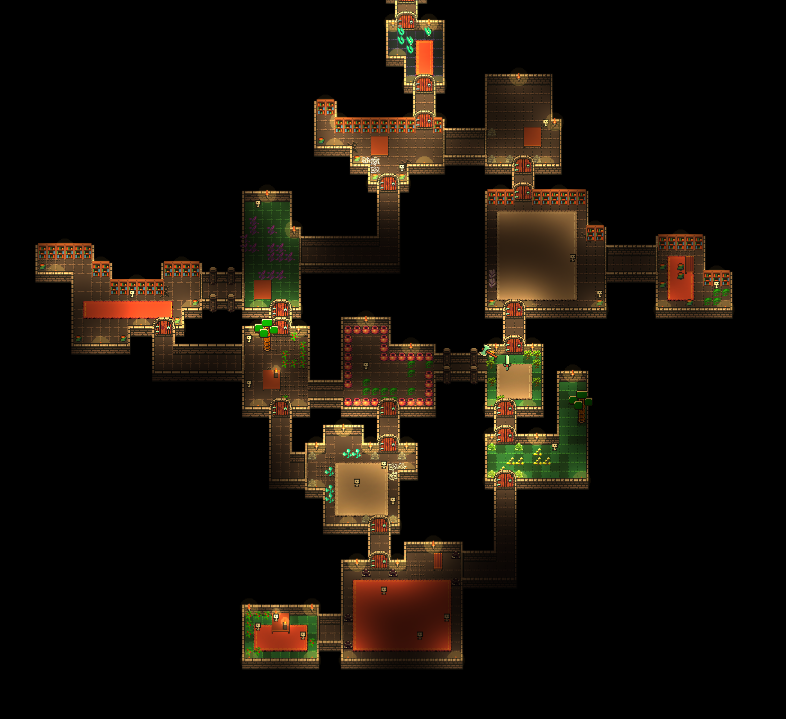

# Enigmagoria
A mobile roguelike game with procedural dungeon generation, responsive combat system and advanced enemy AI. Work in progress.

|  |
|:--:|
| *Rare chess room inside dungeon.* |

The procedural generation algorithm is the most essential part of the game. It can connect arbitrary room shapes with hallways and is very customizable. Inspired from multiple lesser known procgen algorithms, but generally original.

|  |  |
|:--:|:--:|
| *Example 1 of a generated dungeon* | *Example 2 of a generated dungeon* |

By having a strong variety of room shapes, object prefabs, traps, enemies, and items, the replayability of the game is incredibly high compared to some of the most popular games in the genre.

